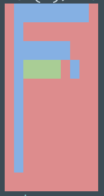
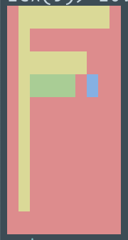

# Canvas

The is my implementation of a technical exercise. The requirements are as follows -

1. Implement a `new` function that creates a new canvas with a given number of rows and columns

```
new(row_count, column_count)
```

2. Implement a `draw_in_cell` function that fills in a row and column with a colour

```
draw_in_cell(row, column, colour)
```

3. Implement a `draw_in_row` function that fills in a row from one column to another with a colour

```
draw_in_row(row, from_column, to_column, colour)
```

3. Implement a `draw_in_column` function that fills in a column from one row to another with a colour

```
draw_in_column(column, from_row, to_row, colour)
```

4. Implement a `flood` function that fills a cell with a colour, and recursively fills all cells above, below, to the left and to the right that are the same colour as the original cell. If the colour is different to the original cell then do not change it. If the cell is diagonally adjacent then do not change it.

```
flood(column, row, colour)
```

For example, in this Elixir implemntation -

```elixir
start = Canvas.new(10, 10)
        |> Canvas.draw_in_cell(4, 8, :blue)
        |> Canvas.draw_in_row(1, 2, 9, :blue)
        |> Canvas.draw_in_column(2, 1, 9, :blue)
        |> Canvas.draw_in_row(3, 3, 7, :blue)
        |> Canvas.draw_in_row(4, 3, 6, :green)
        |> Canvas.draw()
        |> IO.puts()
```

Gives this image -



And `flood`ing cell row=2, column=2 with yellow -
```elixir
start =
  |> Canvas.flood(2, 2, :yellow)
  |> Canvas.draw()
  |> IO.puts()
```

Gives this images -


